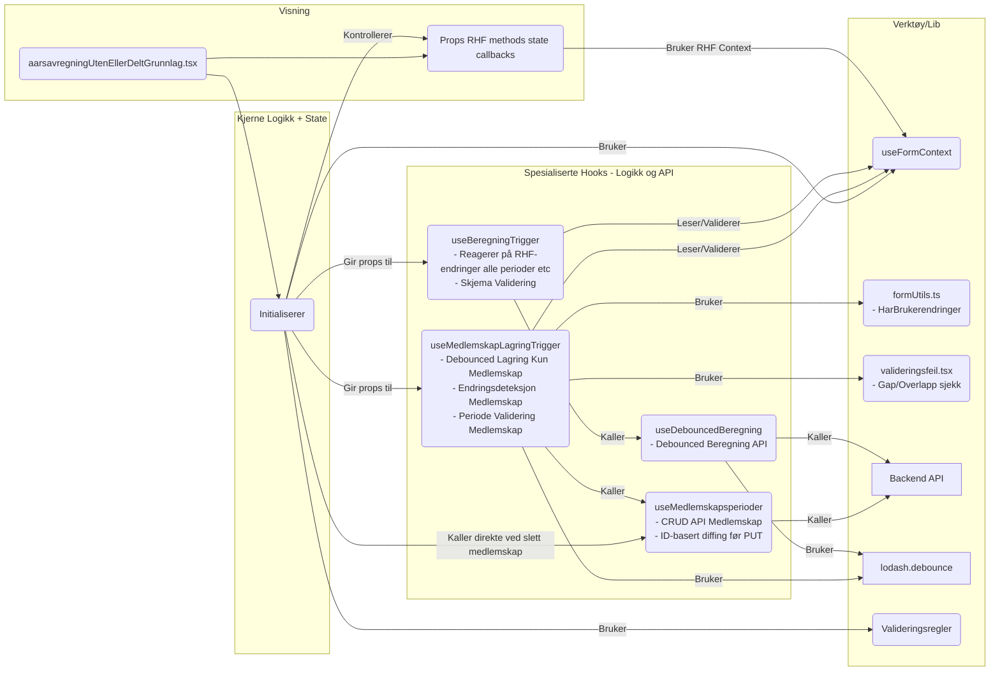
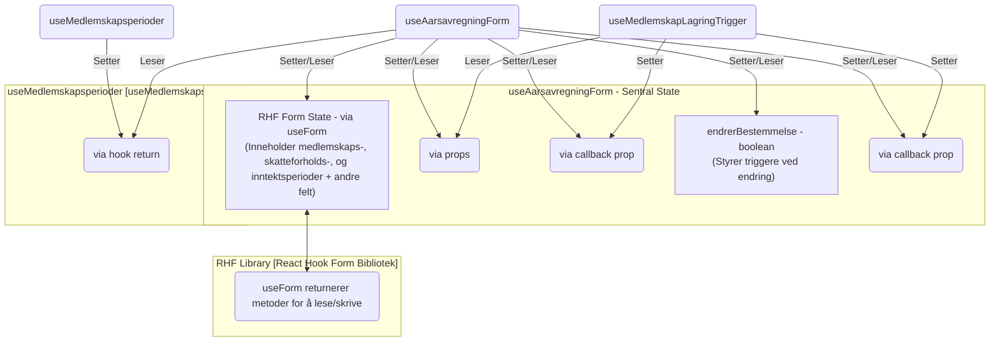
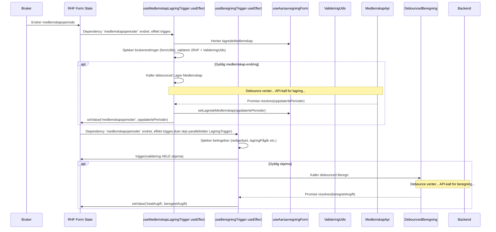
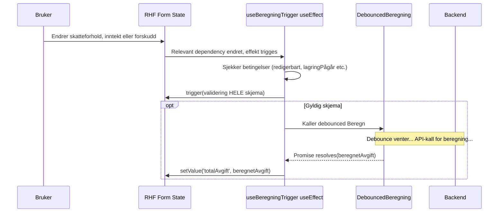
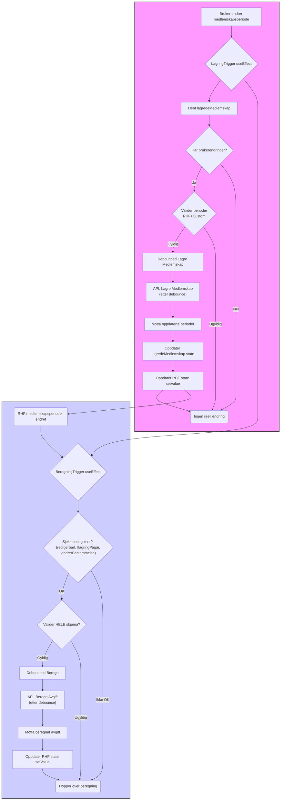
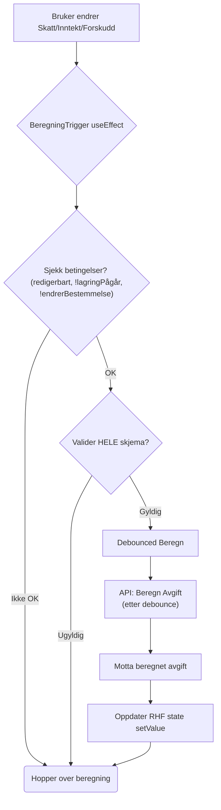
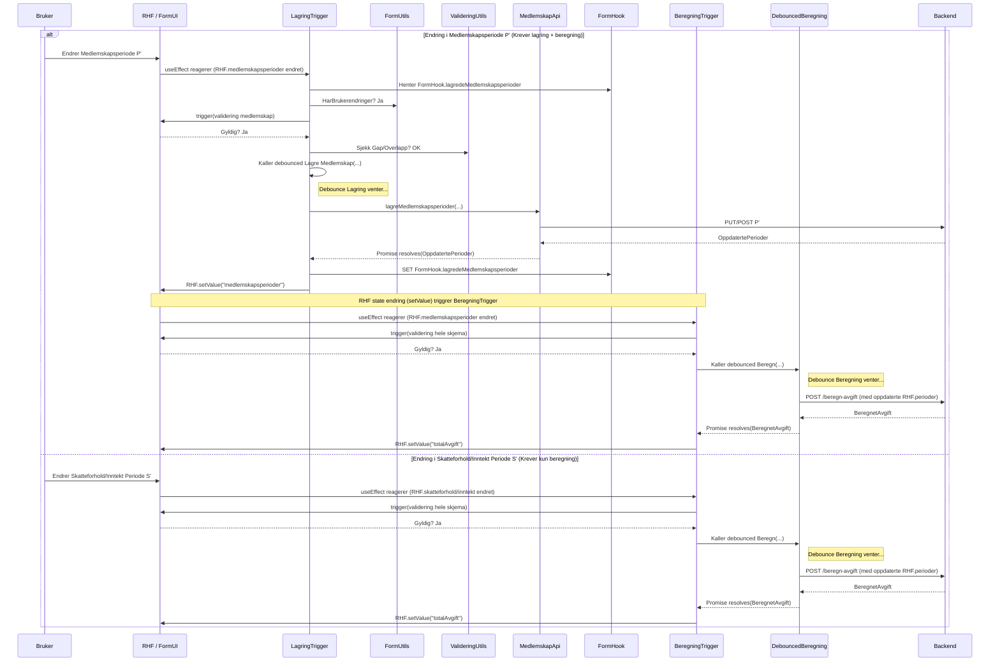

# 6. Arkitektur for Årsavregning (Uten/Delt Grunnlag)

*   Status: Godkjent
*   Dato: 2024-04-08

## Kontekst

Komponenten `aarsavregningUtenEllerDeltGrunnlag` representerer et steg i behandlingen hvor saksbehandler vurderer og fastsetter årsavregning for medlemskap i folketrygden. Steget håndterer to hovedscenarioer:

*   **Uten Grunnlag:** Ingen tidligere relevant behandling finnes i Melosys. Saksbehandler må legge inn all nødvendig informasjon manuelt, inkludert valg av `bestemmelse`, `medlemskapsperioder`, `skatteforholdsperioder`, og `inntektsperioder`.
*   **Delt Grunnlag:** En tidligere behandling (opprinnelig grunnlag) finnes. Skjemaet preutfylles med data fra denne behandlingen. Spesielt replikeres `medlemskapsperioder` fra det opprinnelige grunnlaget, og disse er *låst* for redigering/sletting. Saksbehandler kan kun legge til *nye* medlemskapsperioder og redigere/slette disse nye periodene. `Skatteforholdsperioder` og `inntektsperioder` må også vurderes og potensielt justeres/legges til.

Avhengig av scenario, innebærer steget:
*   Valg av relevant bestemmelse (dersom _uten grunnlag_)
*   Dynamisk administrasjon av periodelister (`medlemskapsperioder`, `skatteforholdsperioder`, `inntektsperioder`) via `useFieldArray`.
*   Fortløpende validering (enkeltfelter via RHF/Zod, komplekse sammenhenger som gap/overlapp i `medlemskapsperioder` via custom logikk).
*   Automatisk, debounced lagring av endringer i *nye/endrede* `medlemskapsperioder` til backend.
*   Automatisk, debounced beregning av total avgift basert på alle relevante input (`medlemskapsperioder`, `skatteforholdsperioder`, `inntektsperioder`, bestemmelse, forskudd etc.).
*   Synkronisering av state mellom frontend (RHF) og backend.
*   Oppdatering av behandlingsstatus.

Kompleksiteten ligger i state-håndtering for dynamiske lister, samspillet mellom RHF og lokal state (`lagredeMedlemskapsperioder`), håndtering av låste vs. editerbare perioder (i Delt Grunnlag), og orkestrering av flere asynkrone, debounced operasjoner (lagring av medlemskap, beregning av avgift) som avhenger av hverandre og av valideringsstatus.

**Hovedutfordringer:**
*   Korrekt synkronisering mellom RHF-state og sist lagret state for `medlemskapsperioder`.
*   Effektiv automatisk lagring (kun for `medlemskapsperioder`) og beregning uten API-overbelastning.
*   Robust håndtering av avhengigheter (endringer i perioder/bestemmelse -> validering -> lagring/beregning).
*   Korrekt håndtering av sletting/redigering i "Uten Grunnlag" vs. "Delt Grunnlag" (låste perioder).
*   Validering av alle periodetyper.

## Beslutning

Løsningen er en lagdelt arkitektur sentrert rundt `useAarsavregningForm`, som bruker RHF og spesialiserte custom hooks.

### Overordnet Struktur og Avhengigheter

### State Management

State håndteres primært av RHF (for alle skjemafelt inkl. periodelistene) og supplert med lokal state i `useAarsavregningForm` for å håndtere den spesifikke logikken rundt lagring og synkronisering av `medlemskapsperioder`.

**Flyt av State:**
1.  Bruker interagerer med `FormUI` (endrer felt, legger til/fjerner i periodelister via `useFieldArray` actions). RHF oppdaterer sin interne state (`InternRHFState`).
2.  `useAarsavregningForm` lytter til RHF state (`RHFState`).
3.  **Medlemskapsperioder:** Endringer i `medlemskapsperioder` (i `RHFState`/`InternRHFState`) får `LagringTrigger` til å reagere. Den leser `lagredeMedlemskapsperioder` (`LagredeMedlemskap`) for å sjekke for reelle endringer. Ved gyldige endringer (etter validering) og debounce, kalles API. Ved suksess oppdateres *både* `lagredeMedlemskapsperioder` (`LagredeMedlemskap`) og RHF state (`RHFState`/`InternRHFState`).
4.  **Alle Perioder / Andre Felt:** Endringer i *alle* felt som `BeregningTrigger` lytter på (inkl. `medlemskapsperioder`, `skatteforholdsperioder`, `inntektsperioder`, `bestemmelse`, etc.) i `RHFState`/`InternRHFState` får `BeregningTrigger` til å reagere. Etter validering og debounce kalles beregnings-API. Resultatet oppdaterer relevante felt i RHF state (`RHFState`/`InternRHFState`).
5.  `Skatteforholdsperioder` og `inntektsperioder` valideres primært via RHF/Zod-skjemaet. Deres lagring skjer sannsynligvis ved *full innsending* av steget, ikke automatisk/debounced slik som `medlemskapsperioder`. (Antagelse - må verifiseres om det er et eget lagrings-API for disse som brukes annerledes).
6.  Valideringsfeil fra RHF/Zod bor i `InternRHFState`. Gap/overlapp-feil for medlemskap settes i `ArrayValideringsfeil`. API-feil fra medlemskap-lagring settes i `ApiFeilmelding`.

### Hovedkomponenter og Hooks (Detaljer)

1.  **Hovedkomponenter:** (`.tsx` og `Form.tsx`). `Form.tsx` rendrer `useFieldArray`-kontroller for alle tre periodetypene. For "Delt Grunnlag" vil UI-logikk (basert på props/state fra `FormHook`) deaktivere knapper for redigering/sletting av de opprinnelige, låste `medlemskapsperiodene`.
2.  **Sentral Hook (`useAarsavregningForm`):** Initialiserer RHF med `useFieldArray` for `medlemskapsperioder`, `skatteforholdsperioder`, og `inntektsperioder`. Håndterer logikk for å identifisere låste perioder i "Delt Grunnlag". Orkestrerer triggere.
3.  **Spesialiserte Hooks:**
    *   `useMedlemskapsperioder`: Som før, fokusert på CRUD for medlemskap.
    *   `useMedlemskapLagringTrigger`: Som før, fokusert på *kun* automatisk lagring av `medlemskapsperioder`.
    *   `useDebouncedBeregning`: Som før.
    *   `useBeregningTrigger`: Viktig: Lytter (`watch`) på endringer i *alle* felt som påvirker beregningen, inkludert `medlemskapsperioder`, `skatteforholdsperioder`, `inntektsperioder`, og `bestemmelse`. Trigger RHF-validering for *hele* skjemaet før den kaller beregnings-API (debounced).
4.  **RHF & Validering:** Zod-skjemaet (`Schema.jsx`) validerer struktur og grunnleggende regler for alle felt, inkludert alle periodelistene. Egen validering (`ValideringUtils`) brukes *kun* for gap/overlapp i `medlemskapsperioder`.
5.  **Endringsdeteksjon & State Sync (Medlemskap):** Som beskrevet tidligere, kritisk for å holde RHF og `lagredeMedlemskapsperioder` synkronisert.
6.  **Lagring (Skatteforhold/Inntekt):** Antas å skje ved innsending av hele steget, ikke via automatisk debounce.

### Spesifikk Interaksjon: Endring av Bestemmelse

Endring av `bestemmelse` (lovhjemmel) er en viktig hendelse:
1.  Bruker endrer `bestemmelse`-feltet i `FormUI`. RHF state oppdateres.
2.  `useAarsavregningForm` har en `useEffect` som lytter spesifikt på `bestemmelse`.
3.  Denne effekten setter `endrerBestemmelse`-state til `true` midlertidig. Dette flagget brukes til å *pause* de automatiske triggerne (`useMedlemskapLagringTrigger` og `useBeregningTrigger`) for å unngå unødvendige operasjoner mens bestemmelsen endres.
4.  `useAarsavregningForm` kaller en funksjon (f.eks. `lagreMedlemskapsperioderEtterBestemmelseEndringHvisGyldig`) som:
    *   Trigger RHF-validering for `medlemskapsperioder`.
    *   Hvis periodene er gyldige, kalles `MedlemskapApi.lagreMedlemskapsperioder` *umiddelbart* (ikke debounced) for å sikre at periodene lagres med den *nye* bestemmelsen.
    *   Etter lagring (eller hvis ugyldig), settes `endrerBestemmelse` tilbake til `false`, slik at de vanlige triggerne kan gjenoppta arbeidet.
5.  `useBeregningTrigger` lytter også på `bestemmelse`, så etter at `endrerBestemmelse` er `false` igjen, vil den trigge en ny beregning (debounced) basert på den nye bestemmelsen og de (nå lagrede) periodene.

### Detaljerte Effekt-drevne Flyter (useEffect)

Disse diagrammene illustrerer den reaktive flyten som starter når en `useEffect`-hook detekterer endringer i spesifikke deler av RHF-state.

#### Effekt: Endring i `medlemskapsperioder`

Denne endringen trigger *både* lagringslogikken for medlemskap *og* beregningslogikken.

#### Effekt: Endring i `skatteforholdsperioder` / `inntektsperioder` / `forskuddsvisFakturert` etc.

Endringer i disse feltene trigger *kun* beregningslogikken (forutsatt at de er dependencies i `useBeregningTrigger`).

### Effekt-drevne Flyter som Flowcharts

Disse diagrammene viser den samme logikken som sekvensdiagrammene over, men som prosess-flowcharts.

#### Flowchart: Effekt av Endring i `medlemskapsperioder`

#### Flowchart: Effekt av Endring i Skatteforhold/Inntekt

## Dataflyt (Fokus på Perioder -> Beregning)

*(Detaljerte sekvensdiagrammer for redigering/legg til og sletting av *medlemskap* beholdes som før)*

## Konsekvenser

*   **Positivt:**
    *   Logikk er modulært organisert i spesialiserte, gjenbrukbare hooks med klare ansvarsområder.
    *   Automatisk lagring og beregning forbedrer brukeropplevelsen og reduserer manuelle steg.
    *   Debouncing optimaliserer ytelse og reduserer API-kall.
    *   Klarere skille mellom RHF-state, "lagret" state (fasit), og beregningslogikk.
    *   Robust håndtering av CRUD for perioder og samspillet med beregning og validering.
*   **Negativt:**
    *   Høyere kompleksitet på grunn av interaksjon mellom flere hooks, states, og asynkrone operasjoner. Flere "lag" med logikk.
    *   Debugging kan være mer krevende; feil kan oppstå i flere ledd (RHF, state sync, debounce, API-hooks, validering, beregning). God logging er viktig.
    *   Krever nøye håndtering av dependencies i `useEffect` i flere hooks for å unngå unødvendige re-renders eller infinite loops. Korrekt bruk av `useCallback` er også viktig. 